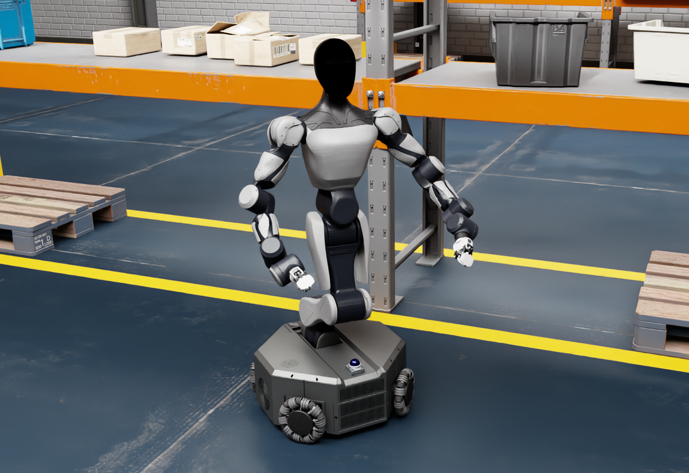

# Robot USDs for ROS2 Control

Robot USD model files for ROS2 Control simulation.


## 1. Gallery

<div align="center">

| | | |
|:---:|:---:|:---:|
|  |  |  |
| **Agibot G1** | **Agilex Aloha Split** | **Agilex Cobot Magic V1** |
|  |  |  |
| **Agilex Cobot Magic V2** | **ARX Lift** | **ARX X7S** |
|  |  |  |
| **ARX Lift 2S** | **Astribot S1** | **Galaxea R1 Lite** |
|  |  |  |
| **Galaxea R1** | **Galaxea R1 Pro** | **Galbot One** |
|  |  |  |
| **Realman Aidal** | **Ai2 Bot2** | **Galbot Zero** |
|  |  |  |
| **Galbot S1** | **Galbot G1** | **Agibot G2** |
|  |  |  |
| **Tianji Gento Luna** | **Tianji Gento Skye** | **Spirit AI MOZ1** |

</div>

## 2. Clone and Setup

**Note:** Some robot assets are distributed as **Git submodules**. You must run the submodule init/update below so that each repository is checked out at the **path expected by this project** (see [§2.1](#21-git-submodules)). Otherwise those assets are missing or empty, and dependent scenes or USD references will not load correctly.

```bash
# Clone the repository
git clone git@github.com:fiveages-sim/robot_usds.git
cd robot_usds

# Initialize and update submodules
git submodule update --init --recursive
```

### 2.1 Git submodules

The following models are **Git submodules** (vendored repositories, checked in as gitlinks at fixed paths in this superproject). Paths are **relative to the `robot_usds` repository root**; init/update must populate **these exact locations** (not arbitrary folders) so that relative paths between USDs resolve. After a plain `git clone`, the submodule directories are empty or absent until you run the commands in §2.

| Path | Upstream repository | `branch` in `.gitmodules`* |
|------|---------------------|----------------------------|
| `humanoid/FiveAges/Gen1` | [fiveages-sim/fiveages-gen1-robot-usds](https://github.com/fiveages-sim/fiveages-gen1-robot-usds) | `main` |
| `humanoid/FiveAges/Gen2` | [fiveages-sim/fiveages-gen2-robot-usds](https://github.com/fiveages-sim/fiveages-gen2-robot-usds) | `main` |
| `humanoid/FiveAges/Gen3` | [fiveages-sim/fiveages-gen3-robot-usds](https://github.com/fiveages-sim/fiveages-gen3-robot-usds) | `main` |
| `humanoid/Ubtech` | [fiveages-sim/ubtech-usds](https://github.com/fiveages-sim/ubtech-usds) | `main` |
| `humanoid/Galbot` | [fiveages-sim/galbot-usds](https://github.com/fiveages-sim/galbot-usds) | `main` |

\*A `branch` value is the remote branch recorded for that submodule. If empty, the superproject still pins a specific commit; use `git submodule update` to check out the recorded revision.

## 3. Models

### 3.1 Models by category

- **Gripper** — under `grippers/`
    - Agibot (`grippers/Agibot/`)
        - OmniPicker (`OmniPicker`)
    - ChangingTek (`grippers/ChangingTek/`)
        - AG2F120S (`AG2F120S`)
        - AG2F90 (`AG2F90`)
    - Inspire (`grippers/Inspire/`)
        - EG2 4C2 (`EG2_4C2`)
    - Jodell (`grippers/Jodell/`)
        - RG75 (`RG75`)
        - ERG32 (`ERG32`)
- **Dexterous Hand** — under `dexhands/`
    - BrainCo (`dexhands/BrainCo/`)
        - Revo1 (`Revo1`)
        - Revo2 (`Revo2`)
    - LinkerHands (`dexhands/LinkerHands/`)
        - L6 (`L6`)
        - o6 (`o6`)
        - o7 (`o7`)
    - RobotEra (`dexhands/RobotEra/`)
        - Xhand1 (`Xhand1`)
    - Wuji (`dexhands/Wuji/`)
        - Hand2 (`Hand2`)
- **Suction cup** — under `suction_cup/`
    - YSW (`suction_cup/YSW/`)
        - E70 (`E70`)
- **Manipulator** — under `manipulators/` (brand folder → product short name)
    - Agilex (`manipulators/AgileX/`)
        - Piper / Piper_H / Piper_X / Piper_L
        - Gripper (`Gripper`)
    - ARX (`manipulators/ARX/`)
        - X5 (`X5`)
        - R5 (`R5`)
        - Gripper 2023 (`Gripper_2023`)
        - Gripper 2025 (`Gripper_2025`)
    - Galaxea (`manipulators/Galaxea/`)
        - A1 / A1X / A1Y / A1Z
        - G1 / G1Z
    - Dobot (`manipulators/Dobot/`)
        - CR5 (`CR5`)
        - CR5 Fa Station (`CR5_Fa_Station`)
    - Elite (`manipulators/Elite/`)
        - EC66 (`EC66`)
    - Fairino (`manipulators/Fairino/`)
        - ART7 (`ART7`)
    - Tianji (`manipulators/Tianji/`)
        - M6 CCS (`M6_CCS`)
        - M6S Lite CCS (`M6S_Lite_CCS`)
        - M6 Fa Station (`M6_Fa_Station`)
        - M20S CCS (`M20S_CCS`)
    - Rokae (`manipulators/Rokae/`)
        - AR5 CCS V1 / V2 (`AR5_CCS_V1`, `AR5_CCS_V2`)
        - AR5 SRS (`AR5_SRS`)
    - Realman (`manipulators/Realman/`)
        - RM75 (`RM75`)
    - HighTorque (`manipulators/HighTorque/`)
        - Panthera HT (`Panthera_HT`)
- **Humanoid** — under `humanoid/`
    - Agibot (`humanoid/Agibot/`)
        - G1 (`G1`)
        - G2 (`G2`)
    - Ai2 (`humanoid/Ai2/`)
        - Bot2 (`Bot2`)
    - Astribot (`humanoid/Astribot/`)
        - S1 (`S1`)
        - Gripper (`Gripper`)
    - FiveAges (`humanoid/FiveAges/`, submodules)
        - W1 / Gen1 (`Gen1`)
        - W2 / S2 / Gen2 (`Gen2`)
        - WCE3 / Gen3 (`Gen3`)
    - Galaxea (`humanoid/Galaxea/`)
        - R1 (`R1`) — includes R1 Pro (Robot variant `R1_Pro`)
        - R1 Lite (`R1_Lite`)
    - Galbot (`humanoid/Galbot` submodule)
        - Galbot One / Zero / S1 / G1
    - Tianji Gento (`humanoid/Gento/`; Gento is a Tianji sub-brand)
        - Luna (`Luna`)
        - Skye (`Skye`)
    - Realman (`humanoid/Realman/`)
        - Aidal (`AIDAL`)
    - Spirit AI (`humanoid/Spirit AI/`)
        - MOZ1 (`MOZ1`)
    - Ubtech (`humanoid/Ubtech` submodule)
        - Cruzr S2 (`Ubtech_CruzrS2`)
- **Mobile Base** — under `mobile_base/`
    - Agilex (`mobile_base/Agilex/`)
        - Ranger Mini
        - Tracer V1
        - Tracer V2
    - Linkhou (`mobile_base/Linkhou/`)
        - Q1 (`Q1`)
        - S2_V1 (`S2_V1`)
        - S2_V2 (`S2_V2`)
        - G2 Chassis (`G2_Chassis`)
    - Angellun (`mobile_base/Angellun/`)
        - Moz1 Chassis (`Moz1_Chassis`)
    - Woosh (`mobile_base/Woosh/`)
        - Ai2 Bot2 Chassis (`Ai2_Bot2_Chassis`)
        - RM AIDAL Chassis (`RM_AIDAL_Chassis`)
- **Mobile Manipulator** — under `mobile_manipulator/`
    - Agilex (`mobile_manipulator/Agilex/`)
        - Split Aloha (`Arm_Left` / `Arm_Right`: Piper, Piper_H, Piper_X, Piper_L)
        - Cobot Magic V1
        - Cobot Magic V2 (`Arm_Left` / `Arm_Right`: Piper, Piper_H, Piper_X, Piper_L)
    - ARX (`mobile_manipulator/ARX/`)
        - Lift (`Lift`)
        - Lift 2S (`Lift 2S`)
        - X7S (`X7S`)
        - AC One Base (`AC_One_Base`)
- **Components** — under `components/` (shared wheels / fixtures)
    - Angellun
        - Angellun_8 (`Angellun_8`)
        - Angellun_10 (`Angellun_10`)
    - omnia_150 (`omnia_150`)
    - fixed_ee (`fixed_ee/`)
        - Concave_type1 / Hook_type1 / Scoop_type1
- **Sensors** — under `sensors/`
    - RealSense (`sensors/realsense/`)
        - d405 / d415 / d435
    - Orbbec (`sensors/orbbec/`)
        - 305 / 336 / 336L / 335Le / 335Lg
        - dabai_agilex / dabai_dw / oradar_ms500
    - RoboSense (`sensors/robosense/`)
        - Airy (`airy`)
    - Linkhou (`sensors/linkhou/`)
        - DS51 (`ds51`)
    - mid360, sdkeli_ls2
    - usb_camera_01 / usb_camera_02
    - ultrasonic (`sensors/ultrasonic/`)
        - ultrasonic_02 / ultrasonic_03
    - 6Dof F&T Sensor
        - KWR75B
    - sick (`sensors/sick/`)
        - nanoScan3
    - sensing (`sensors/sensing/`)
        - SHW5G / AstraS56 / M3A

## 4. Directory Structure

The core directory is `robots`. Brand-owned product trees use **short product names** under a brand folder (same pattern as `manipulators/ARX/X5`, `humanoid/Galaxea/R1`). Gento is a Tianji sub-brand on the humanoid side; the folder remains `humanoid/Gento/`.

```bash
robots/
  grippers/
    Agibot/OmniPicker/  ChangingTek/{AG2F120S,AG2F90}/
    Inspire/EG2_4C2/  Jodell/{RG75,ERG32}/
  dexhands/
    BrainCo/{Revo1,Revo2}/  LinkerHands/{L6,o6,o7}/
    RobotEra/Xhand1/  Wuji/Hand2/
  suction_cup/
    YSW/E70/
  manipulators/
    AgileX/{Piper,Piper_H,Piper_X,Piper_L,Gripper}/
    ARX/{X5,R5,Gripper_2023,Gripper_2025}/
    Galaxea/{A1,A1X,A1Y,A1Z,G1,G1Z}/
    Dobot/{CR5,CR5_Fa_Station}/  Elite/EC66/  Fairino/ART7/
    Tianji/{M6_CCS,M6S_Lite_CCS,M6_Fa_Station,M20S_CCS}/
    Rokae/{AR5_CCS_V1,AR5_CCS_V2,AR5_SRS}/
    Realman/RM75/  HighTorque/Panthera_HT/
  humanoid/
    FiveAges/{Gen1,Gen2,Gen3}/
    Galaxea/{R1,R1_Lite}/
    Galbot/  Agibot/{G1,G2}/
    Gento/{Luna,Skye}/          # Tianji sub-brand
    Astribot/{S1,Gripper}/  Spirit AI/MOZ1/
    Realman/AIDAL/  Ubtech/Ubtech_CruzrS2/
  mobile_base/
    Agilex/{Ranger Mini,Tracer V1,Tracer V2}/
    Linkhou/{Q1,S2_V1,S2_V2,G2_Chassis}/
    Angellun/Moz1_Chassis/
    Woosh/{Ai2_Bot2_Chassis,RM_AIDAL_Chassis}/
  mobile_manipulator/
    ARX/{Lift,Lift 2S,X7S,AC_One_Base}/
    Agilex/{Cobot Magic V1,Cobot Magic V2,Split Aloha}/
  components/
    Angellun_8/  Angellun_10/  omnia_150/
    fixed_ee/{Concave_type1,Hook_type1,Scoop_type1}/
  sensors/
    realsense/{d405,d415,d435}.usd
    orbbec/{305,336,336L,335Le,335Lg,dabai_agilex,dabai_dw,oradar_ms500}.usd
    robosense/airy.usd  linkhou/ds51.usd
    sensing/  sick/  ultrasonic/
  README.md
  LICENSE
```

Some scenes under `*/env/` depend on external environment assets (see §5).

## 5. Using Environment Assets

To use environment assets, create an `environment` folder at the same level as `robots`, then clone `fiveages_env` inside it:

```bash
# Go to the parent directory of robots (adjust the path as needed)
cd /home/fiveages/Documents/usd

mkdir -p environment
cd environment

# Clone the environment assets repository
git clone git@github.com:fiveages-sim/fiveages-env-usds.git fiveages_env
```

After cloning, your directory layout should look like:

```bash
/home/fiveages/Documents/usd/
  robots/
  environment/
    fiveages_env/
```

With this layout, scenes that depend on environment assets can correctly reference content from `environment/fiveages_env`.