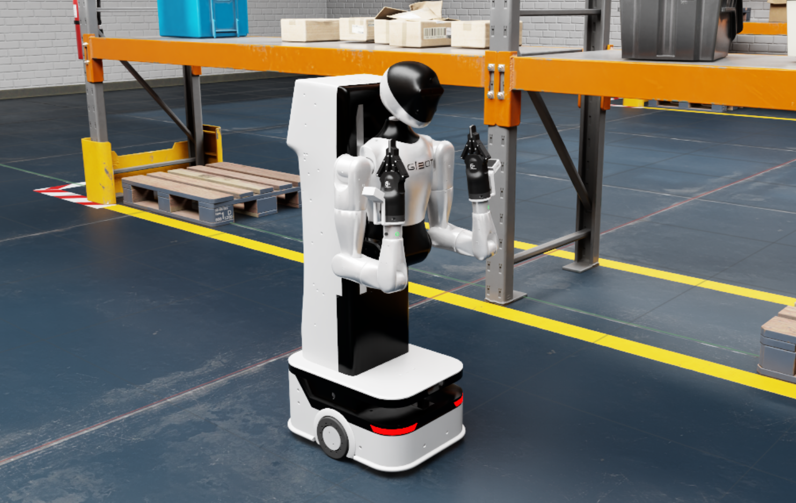
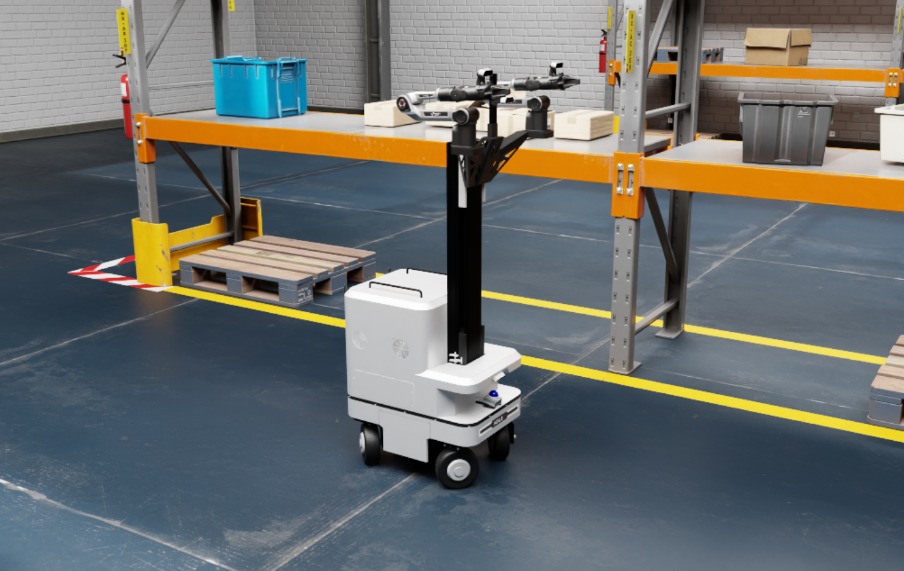
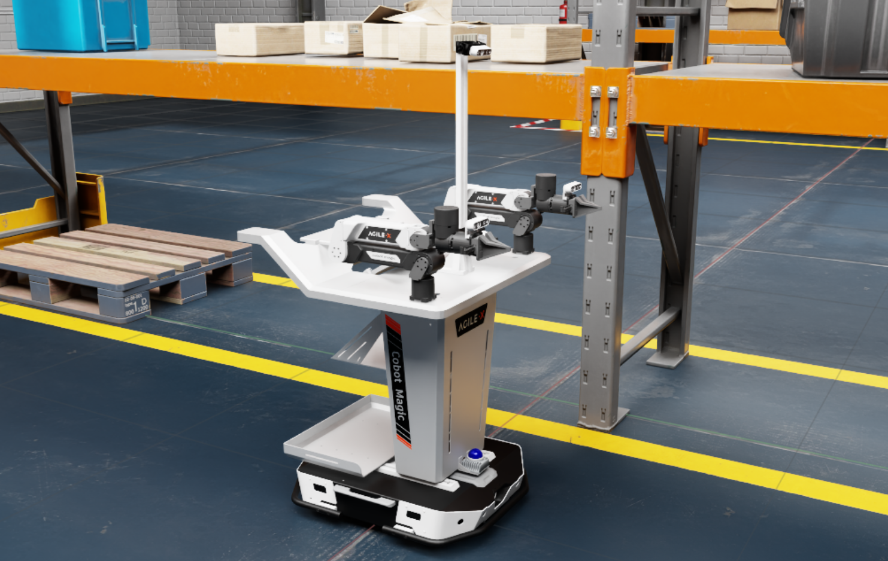
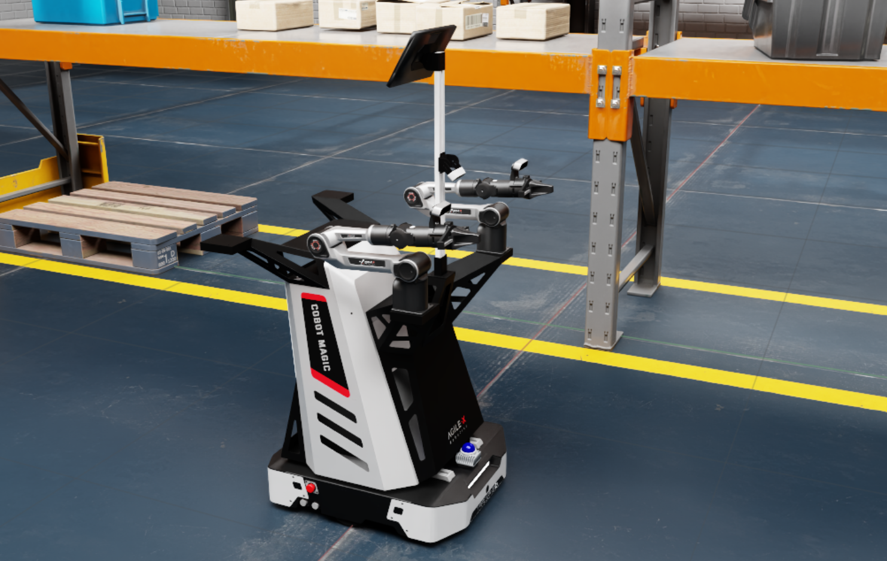
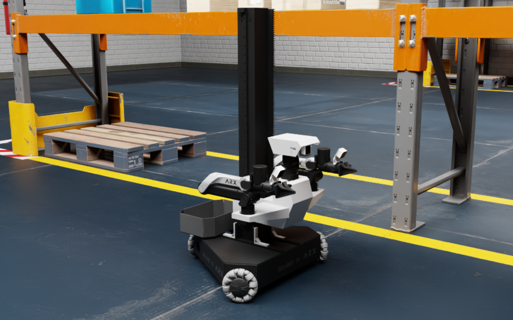
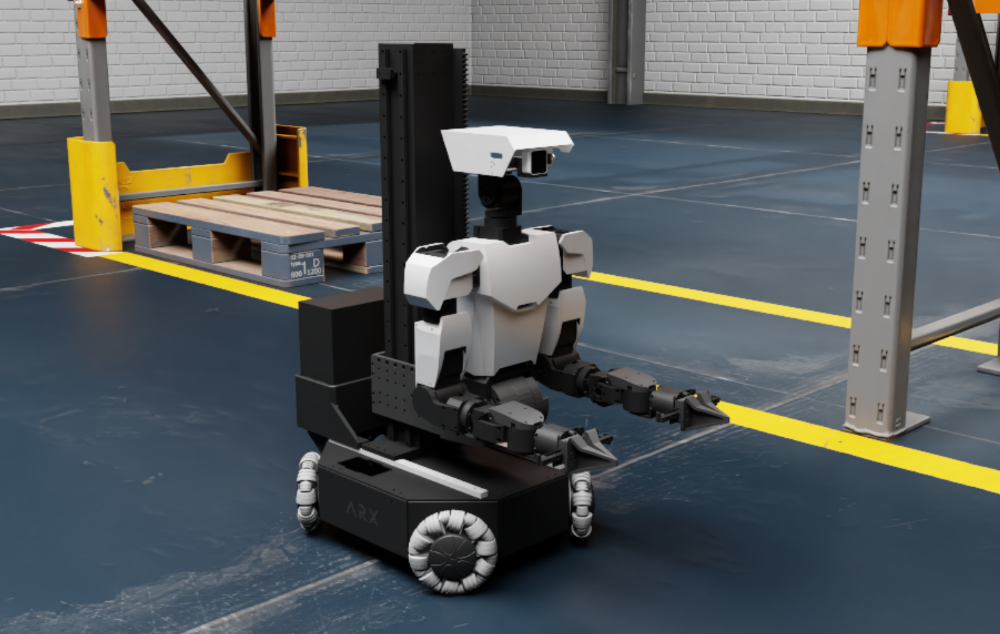
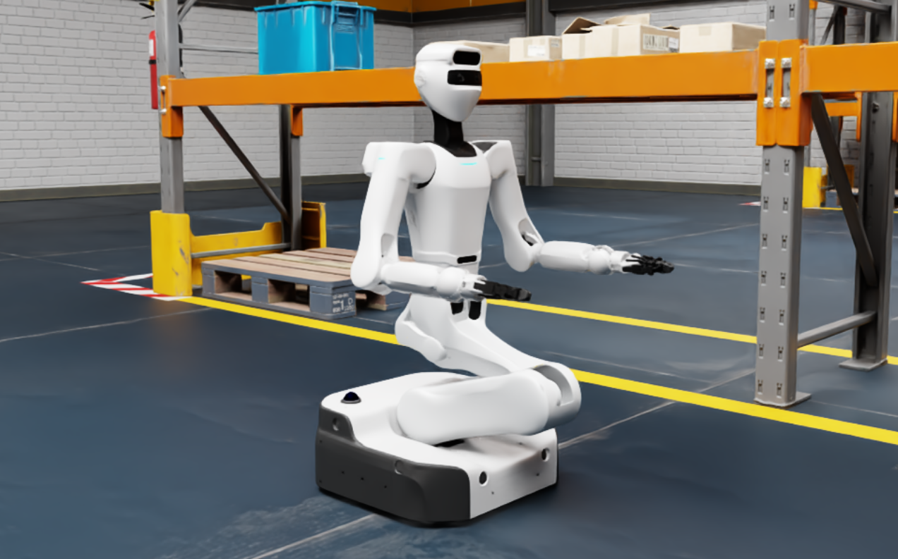
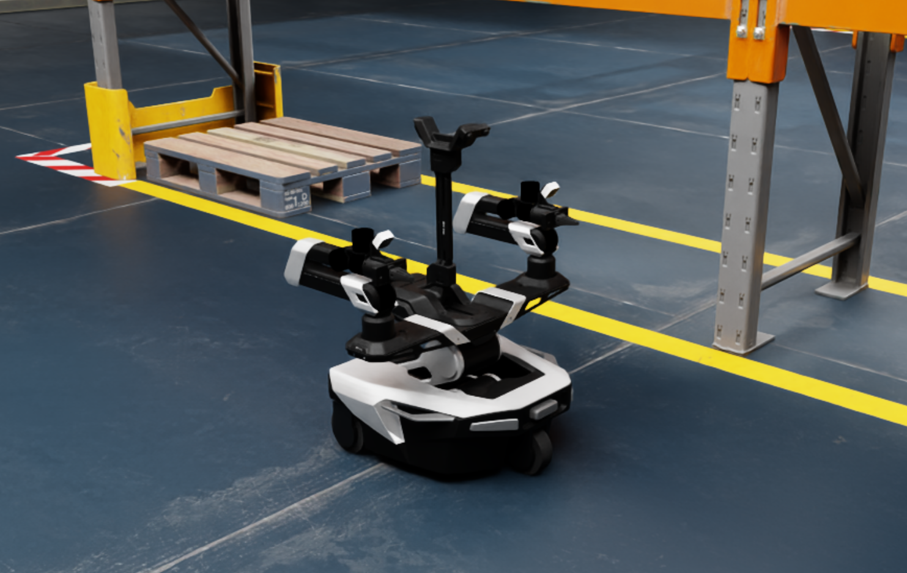
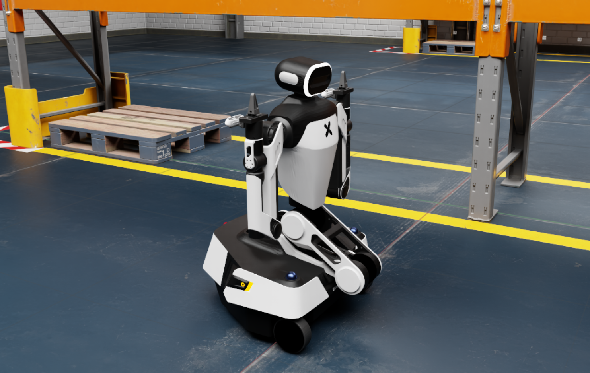
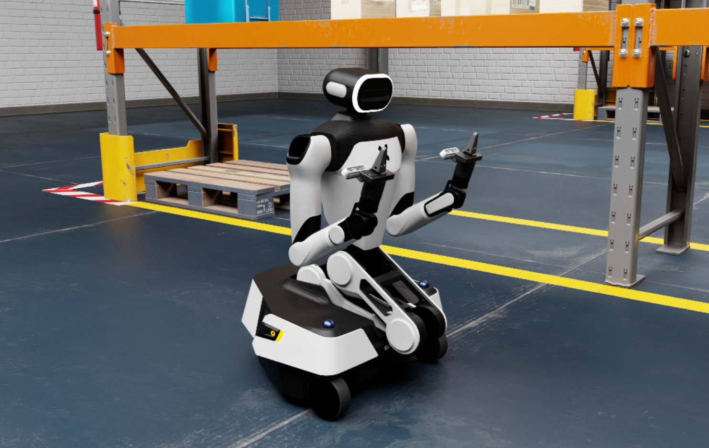

# 面向 ROS2 Control 的机器人 USD 资源

机器人 USD 模型文件，用于 ROS2 Control 仿真。


https://github.com/user-attachments/assets/5aea688f-bd91-41c7-8ce3-bc57e192f31e

## 照片墙

<div align="center">

| | | |
|:---:|:---:|:---:|
|  |  |  |
| **Agibot G1** | **Agilex Aloha Split** | **Agilex Aloha V1** |
|  |  |  |
| **Agilex Aloha V2** | **ARX Lift** | **ARX X7S** |
|  |  |  |
| **Astribot S1** | **Galaxea R1 Lite** | **Galaxea R1** |
|  | | |
| **Galaxea R1 Pro** | | |

</div>

## 克隆与初始化

```bash
# 克隆仓库
git clone git@github.com:fiveages-sim/robot_usds.git
cd robot_usds

# 初始化并更新子模块
git submodule update --init --recursive
```

## 模型

- **Gripper（夹爪）**
    - ChangingTek_AG2F120S
    - ChangingTek_AG2F90_C
        - ChangingTek_AG2F90_C 的软垫版本（刚体模拟）
    - ChangingTek_AG2F90_C_Soft
    - Galaxea_G1
    - Inspire_EG2_4C2
    - Jodell_RG75
    - OmniPicker
    - Robotiq_85
- **Manipulator（机械臂）**
    - ARX
        - R5
        - X5
    - ARX5_agilex
    - DobotCR5
        - Dobot CR5 双臂
    - Elite_EC66
    - Galaxea
        - A1
        - A1X
        - A1Y
    - Piper
    - rm65
- **Humanoid（人形机器人）**
    - Agibot_G1
    - Agibot_G2
    - ARX_Lift
    - ARX_X7S
    - Astribot_S1
    - FiveAges_W1
    - FiveAges_W2
    - Galaxea_R1
        - Galaxea_R1_Pro
- **Mobile Base（移动底盘）**
    - Agilex_Ranger_Mini
    - Agilex_Tracer
    - Agilex_Tracer_V2
- **Mobile Manipulator（移动机械臂）**
    - Agilex_Aloha_Spilt
    - Agilex_Aloha_V1
    - Agilex_Aloha_V2
    - Galaxea_R1_Lite
- **Sensors（传感器）**
    - d405
    - d435
    - dabai
    - mid360
    - orbbec_336
    - orbbec_336L

## 文件结构

项目核心目录为 `robots`，包含以下子目录与资源：

```bash
robots/
  grippers/           # 夹爪模型及按功能拆分的配置
  manipulators/       # 机械臂模型、环境示例与配置
  humannoid/          # 人形机器人模型及配置
  mobile_base/        # 移动底盘模型及配置
  mobile_manipulator/ # 移动机械臂模型及配置
  sensors/            # 传感器模型
  README.md
  LICENSE
```

`manipulators/*/envs/` 下的部分场景依赖外部环境资源（纹理、资产、共享组件等）。

## 使用环境内容

如需使用环境的内容，请在与 `robots` 同级的位置新建一个 `environment` 文件夹，并在该文件夹内克隆 `fiveages_env`：

```bash
# 进入 robots 的上级目录（示例路径按需调整）
cd /home/fiveages/Documents/usd

mkdir -p environment
cd environment

# 克隆环境资源仓库
git clone git@github.com:fiveages-sim/fiveages-env-usds.git fiveages_env
```

完成后目录结构应类似：

```bash
/home/fiveages/Documents/usd/
  robots/
  environment/
    fiveages_env/
```

这样，依赖环境资源的场景即可正常引用 `environment/fiveages_env` 中的内容。
