# 面向 ROS2 Control 的机器人 USD 资源

机器人 USD 模型文件，用于 ROS2 Control 仿真。


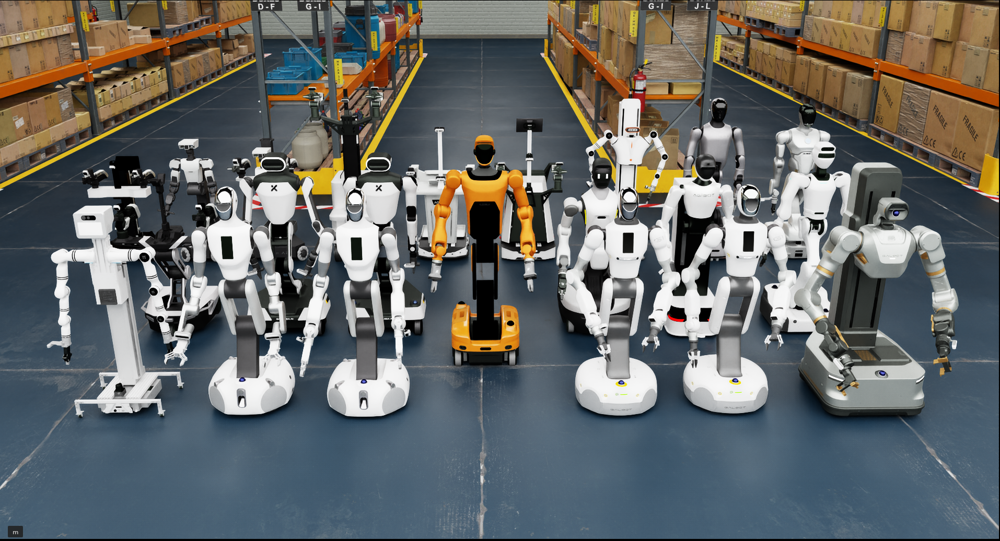

## 1. 照片墙

<div align="center">

| | | |
|:---:|:---:|:---:|
| 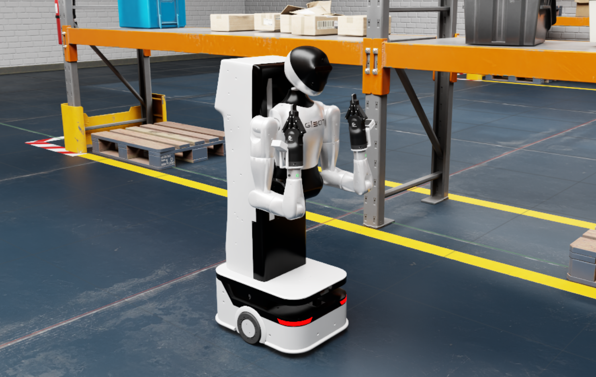 | 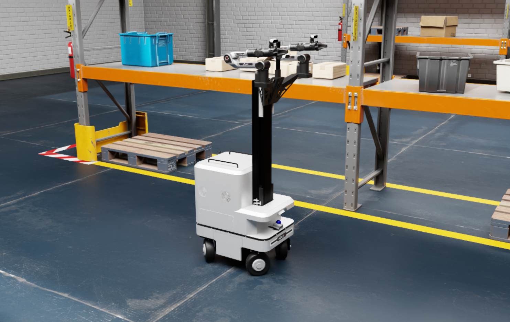 | 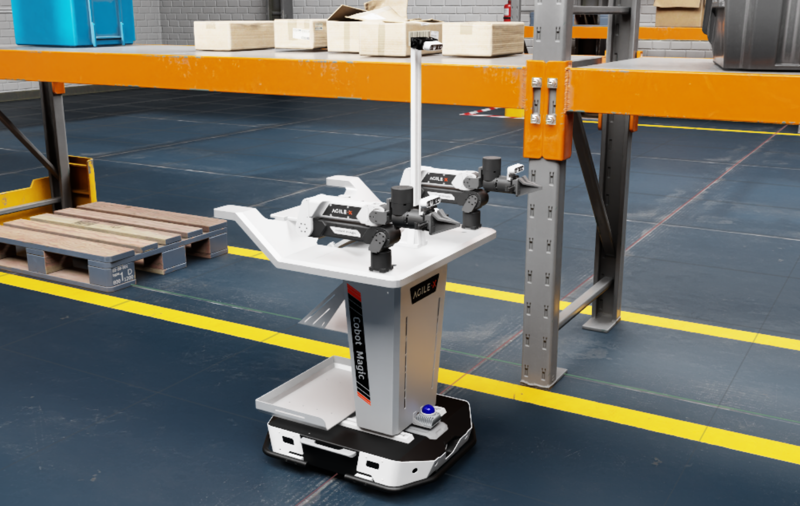 |
| **智元 G1** | **松灵 Aloha Split** | **松灵 Aloha V1** |
| 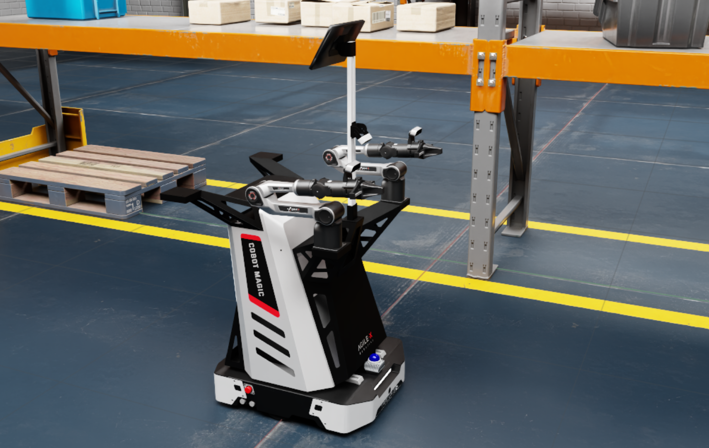 | 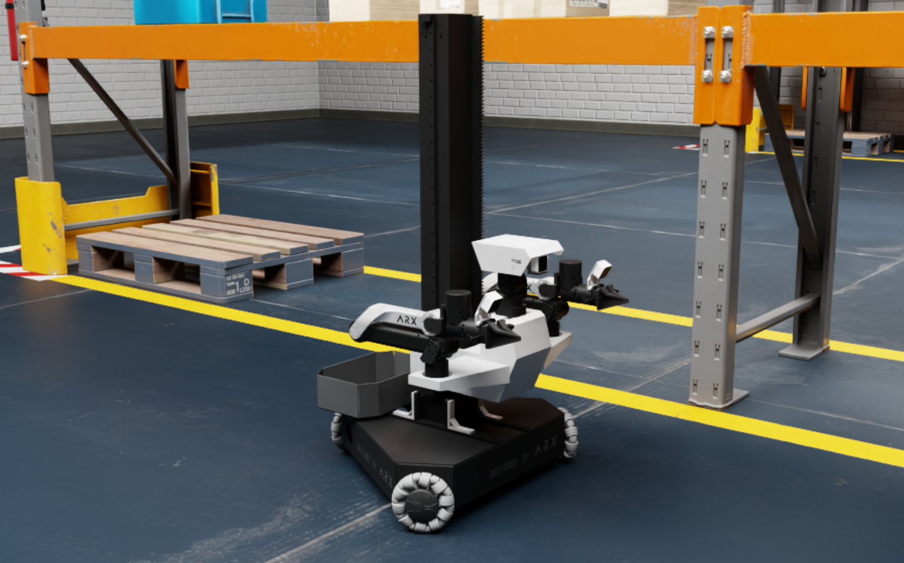 | 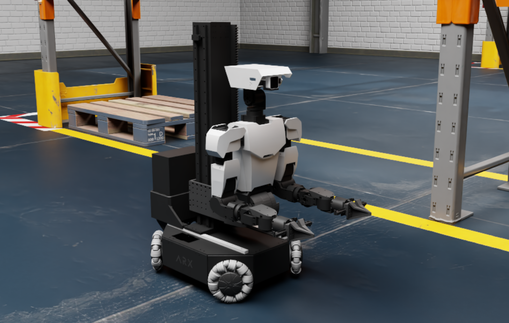 |
| **松灵 Aloha V2** | **方舟无限 Lift** | **方舟无限 X7S** |
| 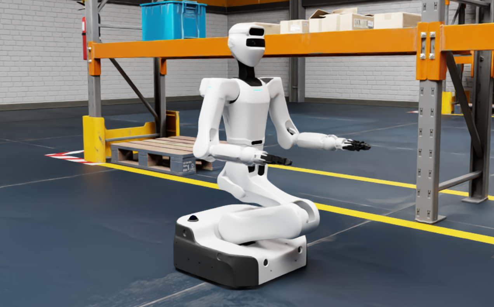 | 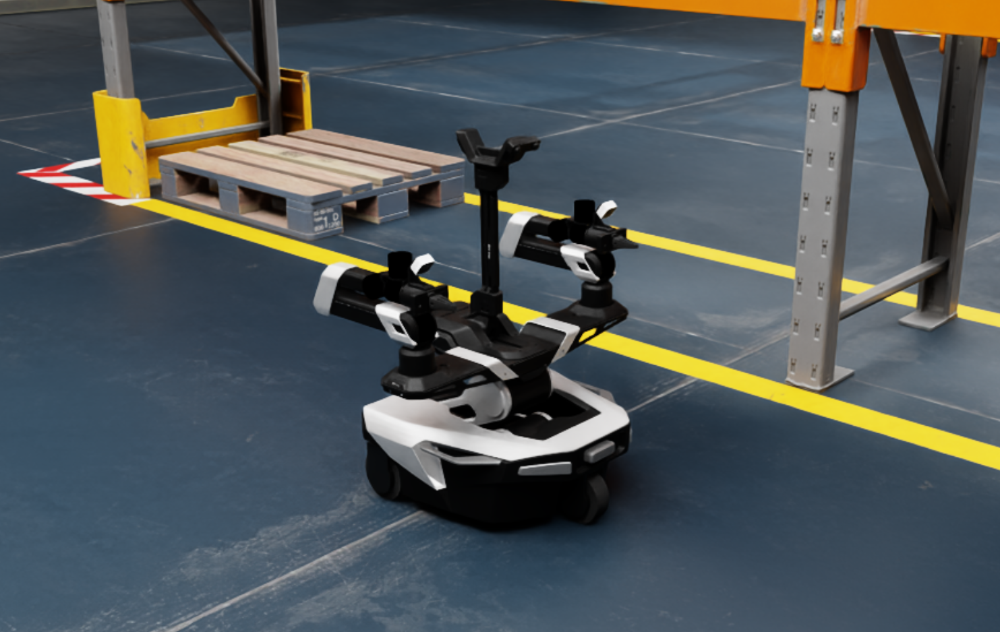 | 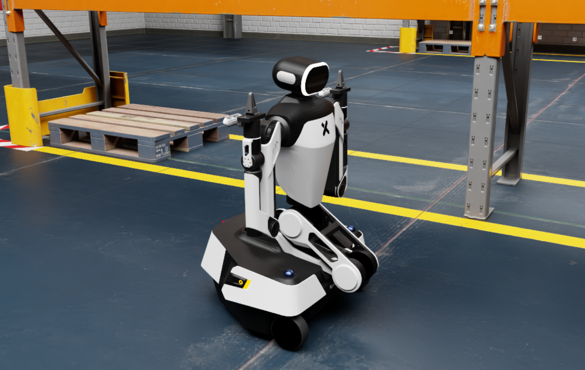 |
| **星尘智能 S1** | **星海图 R1 Lite** | **星海图 R1** |
| 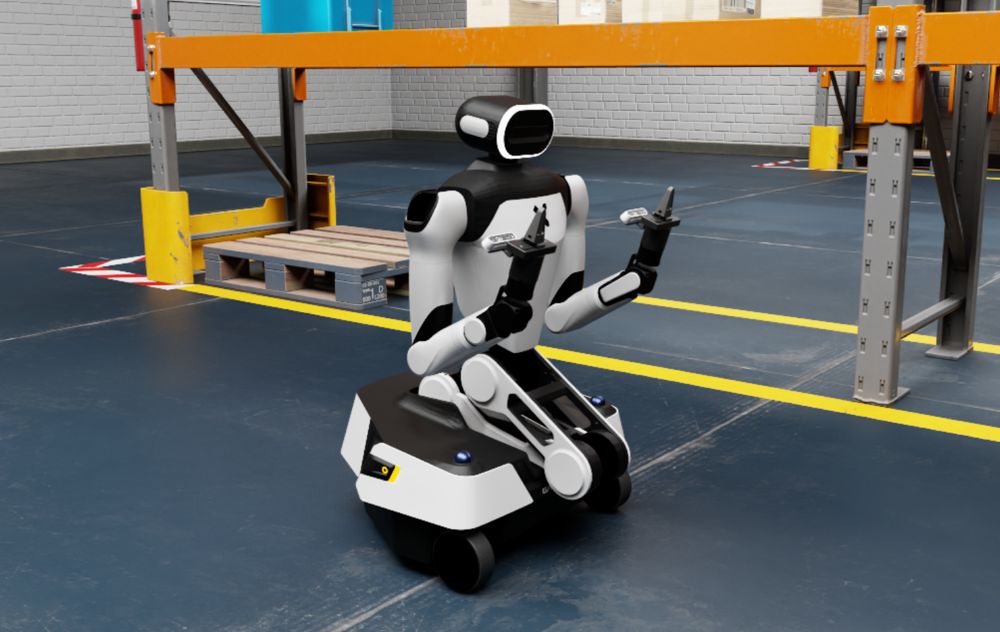 |  |  |
| **星海图 R1 Pro** | **银河通用 Galbot One** | **睿尔曼 Aidal** |
| 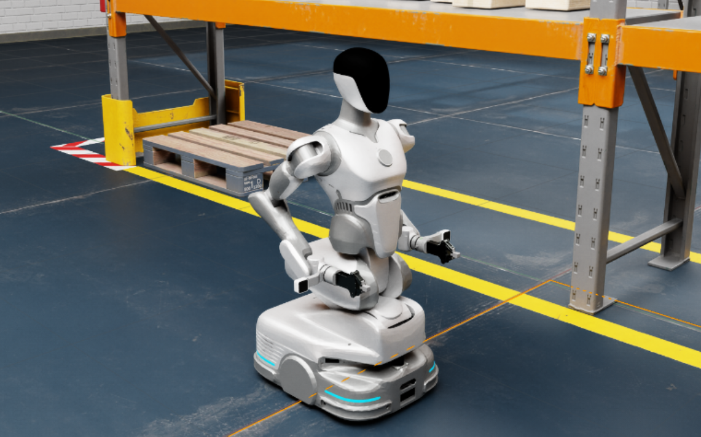 | 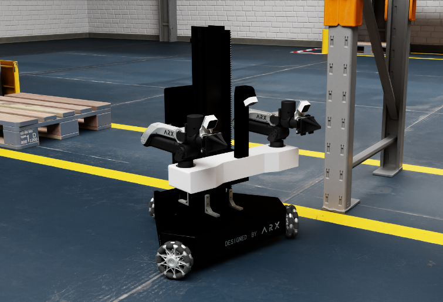 |  |
| **智平方 Bot2** | **方舟无限 Lift2S** | **银河通用 Galbot Zero** |
|  |  | |
| **银河通用 S1** | **银河通用 G1** | |

</div>

## 2. 克隆与初始化

**说明：** 部分机器人资产以 **Git 子模块** 管理，**必须**按本仓库约定的路径将子模块初始化并拉取到正确位置（见下节命令与 [§2.1](#21-子模块git) 中的路径表），相关 USD 与层引用才能被正常解析；只克隆父仓库、不执行子模块更新时，这些目录会为空或不存在，相关场景无法正常使用。

```bash
# 克隆仓库
git clone git@github.com:fiveages-sim/robot_usds.git
cd robot_usds

# 初始化并更新子模块
git submodule update --init --recursive
```

### 2.1 子模块（Git）

以下目录为 **Git 子模块**（在父仓库中通过子模块 commit 与固定路径挂载）。**路径均相对于本仓库 `robot_usds` 根目录，且需落在表中位置**（子模块必须检出到这些路径，而不是任意副本），否则与主仓库内其他 USD 的相对引用会失效。仅在上面的「初始化并更新子模块」执行完成后，这些目录中才会有完整内容。

| 路径 | 上游仓库 | `.gitmodules` 中的 `branch`* |
|------|----------|------------------------------|
| `humanoid/FiveAges/Gen2` | [fiveages-sim/fiveages-gen2-robot-usds](https://github.com/fiveages-sim/fiveages-gen2-robot-usds) | `main` |
| `humanoid/FiveAges/Gen3` | [fiveages-sim/fiveages-gen3-robot-usds](https://github.com/fiveages-sim/fiveages-gen3-robot-usds) | `main` |
| `humanoid/FiveAges_W1` | [fiveages-sim/fa-w1-usds](https://github.com/fiveages-sim/fa-w1-usds) | `main` |
| `humanoid/Agibot_G2` | [fiveages-sim/agibot-g2-usds](https://github.com/fiveages-sim/agibot-g2-usds) | — |
| `humanoid/Ubtech` | [fiveages-sim/ubtech-usds](https://github.com/fiveages-sim/ubtech-usds) | `main` |
| `humanoid/Galbot` | [fiveages-sim/galbot-usds](https://github.com/fiveages-sim/galbot-usds) | `main` |

\*`branch` 为子模块配置里记录的远程分支，便于 `git submodule update --remote` 等；未填写时，父仓库仍通过固定 commit 锁版本，使用 `git submodule update` 会检出所记录的该提交。

## 3. 模型

### 3.1 中文简称与英文标识对照

展示名尽量采用 **「中文简称 + 型号」**（与 **智元 G1** 同类）；下表给出与仓库目录、USD 中常用 **英文标识** 的对应关系。

| 中文简称 | 英文品牌 / 常用标识 |
|:---|:---|
| 智元 | Agibot、OmniPicker |
| 松灵 | Agilex、Piper |
| 方舟无限 | ARX |
| 星尘智能 | Astribot |
| 星海图 | Galaxea |
| 银河通用 | Galbot |
| 睿尔曼 | Realman |
| 越疆 | Dobot |
| 艾利特 | Elite |
| 因时 | Inspire |
| 强脑 | BrainCo |
| 灵心巧手 | LinkerHand |
| 知行 | ChangingTek |
| 钧舵 | Jodell |
| 智平方 | Ai2 |
| 中科第五纪 | FiveAges |
| 优必选 | Ubtech |
| 天机智能 | Tianji、Marvin（系列） |
| （保留英文） | Robotiq |

### 3.2 按类别列出

- **Gripper（夹爪）** — 对应 `grippers/` 下目录名
    - 知行 AG2F120S
    - 知行 AG2F90
    - 星海图 G1
    - 因时 EG2 4C2
    - 钧舵 RG75
    - 智元 OmniPicker
    - Robotiq 85
- **Dexterous Hand（灵巧手）** — 对应 `dexhands/` 下目录名
    - 强脑 Revo1
    - 强脑 Revo2
    - 灵心巧手 o6
    - 灵心巧手 o7
- **Manipulator（机械臂）** — 对应 `manipulators/` 下目录名
    - 方舟无限（`manipulators/ARX/`）
        - `ARX_R5`
        - `ARX_X5`
        - `ARX5_Agilex`
        - `ARX5_Gripper_2023`
        - `ARX5_Gripper_2025`
    - 越疆 DobotCR5
        - 越疆 Dobot CR5 Dual Arm
    - 艾利特 EC66
    - 星海图（`manipulators/Galaxea/`）
        - A1
        - A1X
        - A1Y
    - 松灵（`manipulators/Agilex/`）
        - Piper
    - 天机智能（`manipulators/Tianji/`）
        - M6 CCS（`M6_CCS`）
    - 睿尔曼 RM75（`Realman_RM75`）
- **Humanoid（人形机器人）** — 对应 `humanoid/` 下目录名
    - 智元 G1
    - 智元 G2
    - 智平方 Bot2
    - 方舟无限 Lift（`humanoid/ARX_Lift`）
    - 方舟无限 X7S（`humanoid/ARX_X7S`）
    - 星尘智能 S1
    - 越疆 Atom（`Dobot_Atom`）
    - 中科第五纪 W1
    - 中科第五纪 W2
    - 中科第五纪 WCE3
    - 银河通用 Galbot（`humanoid/Galbot` 子模块）
        - Galbot One（`Galbot_One`）
        - Galbot Zero（`Galbot_Zero`）
        - Galbot S1（`Galbot_S1`）
        - Galbot G1（`Galbot_G1`）
    - 星海图 R1（`Galaxea_R1`）
        - 星海图 R1 Pro
    - 睿尔曼 Aidal（`Realman_AIDAL`）
    - 优必选（`Ubtech`）
- **Mobile Base（移动底盘）** — 对应 `mobile_base/` 下目录名
    - 松灵 Ranger Mini
    - 松灵 Tracer
    - 松灵 Tracer V2
- **Mobile Manipulator（移动机械臂）** — 对应 `mobile_manipulator/` 下目录名
    - 松灵 Aloha Spilt
    - 松灵 Aloha V1
    - 松灵 Aloha V2
    - 方舟无限 Lift2S（`mobile_manipulator/ARX_Lift2S`）
    - 星海图 R1 Lite（`mobile_manipulator/Galaxea_R1_Lite`）
- **Sensors（传感器）** — 对应 `sensors/` 下 `.usd` 资源
    - 英特尔实感 D405（Intel RealSense）
    - 英特尔实感 D415（Intel RealSense）
    - 英特尔实感 D435（Intel RealSense）
    - dabai
    - mid360
    - oradar ms500
    - 奥比中光 orbbec 336
    - 奥比中光 orbbec 336L
    - 奥比中光 orbbec dabai dw
    - usb camera 01
- **Stands（支架）** — 对应 `stands/` 下目录名
    - Dual Stand1
    - Dual Stand2

## 4. 文件结构

项目核心目录为 `robots`，包含以下子目录与资源：

```bash
robots/
  grippers/           # 夹爪模型及按功能拆分的配置
  dexhands/           # 灵巧手模型及配置
  manipulators/       # 机械臂模型、环境示例与配置
  humanoid/          # 人形机器人模型及配置
  mobile_base/        # 移动底盘模型及配置
  mobile_manipulator/ # 移动机械臂模型及配置
  sensors/            # 传感器模型
  stands/             # 支架 / 工装模型
  README.md
  LICENSE
```

`manipulators/*/envs/` 下的部分场景依赖外部环境资源（纹理、资产、共享组件等）。

## 5. 使用环境内容

如需使用环境的内容，请在与 `robots` 同级的位置新建一个 `environment` 文件夹，并在该文件夹内克隆 `fiveages_env`：

```bash
# 进入 robots 的上级目录（示例路径按需调整）
cd /home/fiveages/Documents/usd

mkdir -p environment
cd environment

# 克隆环境资源仓库
git clone git@github.com:fiveages-sim/fiveages-env-usds.git fiveages_env
```

完成后目录结构应类似：

```bash
/home/fiveages/Documents/usd/
  robots/
  environment/
    fiveages_env/
```

这样，依赖环境资源的场景即可正常引用 `environment/fiveages_env` 中的内容。
